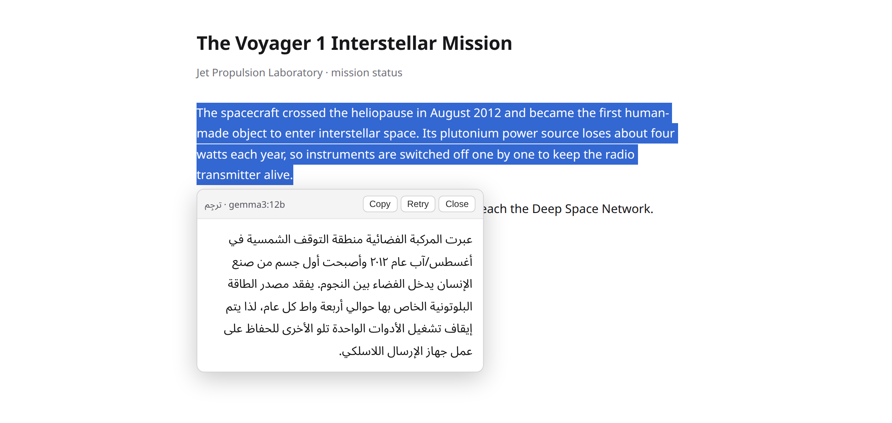
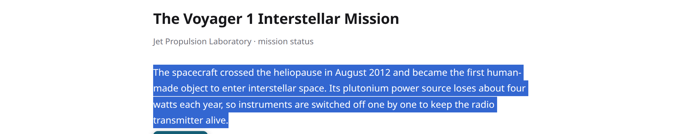
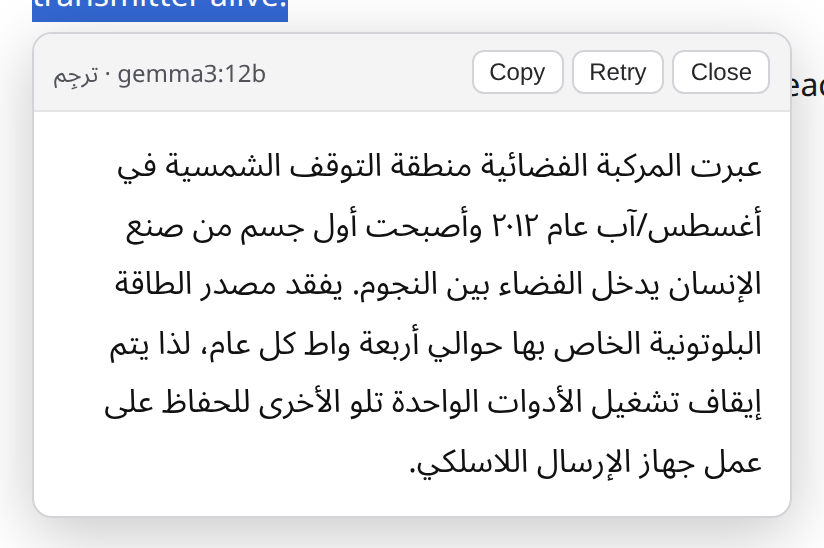
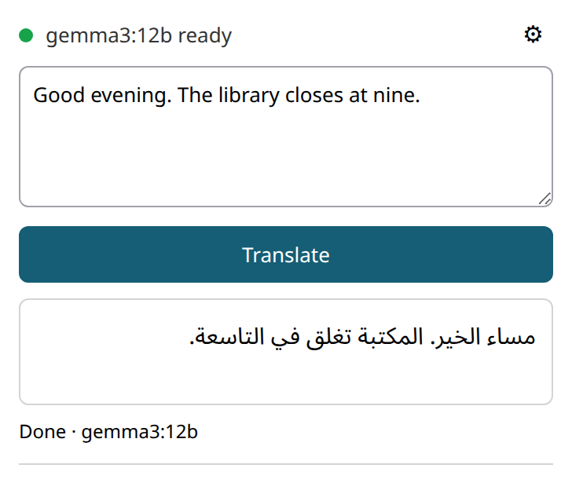
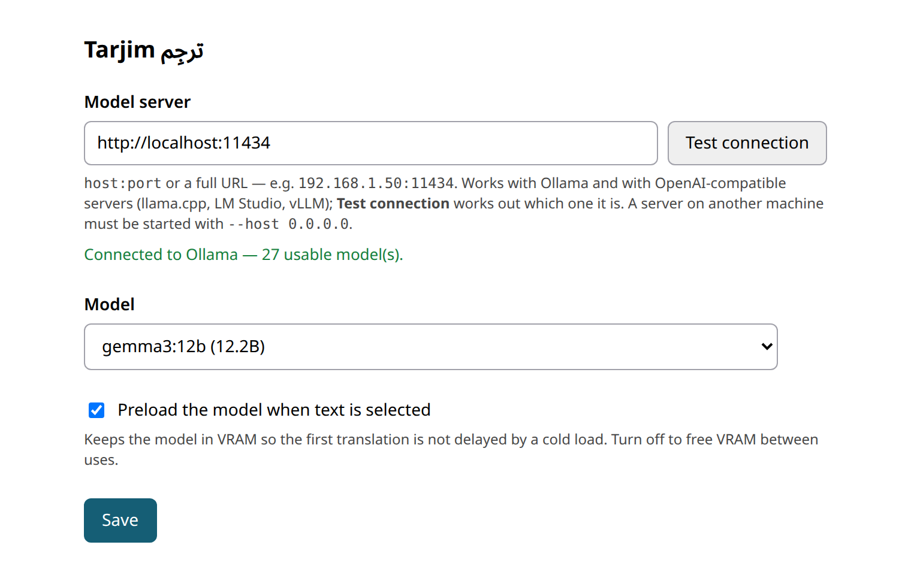
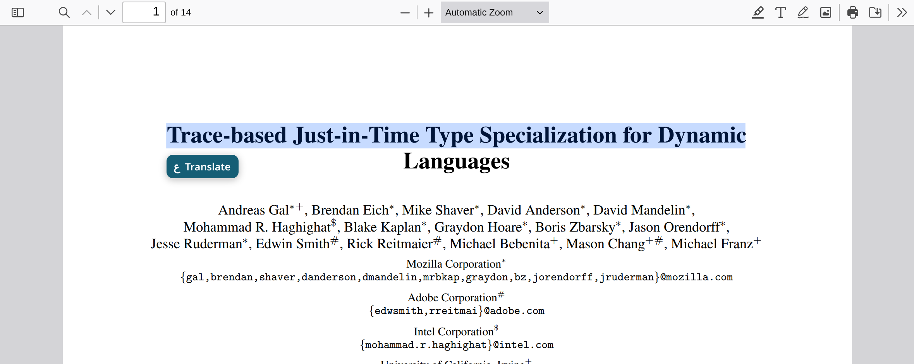

# Tarjim ترجِم

Select text in your browser, get Modern Standard Arabic back. The model runs on
**your own machine** — nothing is sent to a cloud service.



## Start here

About 10 minutes, and most of that is the model downloading.

1. Run `sudo tools/setup-ollama-cors.sh` — Ollama answers `403` to extensions until you do
2. Run `ollama pull gemma3:12b` — 8 GB, the default model
3. Open `brave://extensions` (or `chrome://extensions`) and switch on **Developer mode**
4. Click **Load unpacked** and pick this folder
5. Select a sentence on any page and click the **Translate** bubble

Nothing to build. If step 1 fails, [read why it exists](docs/WHY.md#why-ollama-answers-403-until-you-run-a-script).

## Four ways to trigger it

| Trigger | What you do |
|---|---|
| Bubble | Select text → click **Translate** |
| Keyboard | Select text → `Alt+T` |
| Right-click | Select text → *Translate selection to Arabic* |
| Toolbar | Click the icon → paste text → **Translate** |
| PDF | Toolbar icon → **Open this PDF in the translator viewer** |



Click it, and the panel streams tokens as the model produces them.



`Esc` closes it. **Copy** puts plain Arabic on the clipboard. **Stop** aborts
mid-stream. **Retry** re-runs the same selection.

## Paste text instead

Click the toolbar icon. The dot is green when your model is loaded and ready.



## Point it at a different server

`brave://extensions` → **Details** → **Extension options**.



**Test connection** works out on its own whether the address is Ollama or an
OpenAI-compatible server, so you type an address and nothing else.

## Run a bigger model on another PC

Start a server on the other machine — the `--host 0.0.0.0` matters, the default
binding is loopback-only:

```bash
llama-server -hf unsloth/Qwen3-27B-GGUF:UD-Q4_K_M --host 0.0.0.0 --port 8081
```

Put its address in **Model server** and press **Test connection**:

```
192.168.1.50:8081
→ Connected to OpenAI-compatible server — 1 usable model(s).
```

Ollama, llama.cpp `llama-server`, LM Studio and vLLM all work.
[How the detection works](docs/WHY.md#using-llamacpp-lm-studio-or-vllm-instead-of-ollama).

## PDFs

Chrome's built-in PDF viewer cannot hand a selection to any extension, so
Tarjim ships its own PDF.js viewer where selection works normally.



For PDFs on disk (`file://`), switch on **Allow access to file URLs** on the
extension's Details page. [Why a second viewer is needed](docs/WHY.md#why-pdfs-need-a-separate-viewer).

## Something is wrong

| What you see | Fix |
|---|---|
| `Ollama refused the extension's origin (403)` | `sudo tools/setup-ollama-cors.sh` |
| `Cannot reach Ollama` | `systemctl status ollama`, then check the endpoint in options |
| `Nothing answered at that address` | Restart the remote server with `--host 0.0.0.0` |
| **Every** translation takes minutes | The model does not fit in VRAM. The popup names the exact GPU split |
| Empty translation after a long wait | A `qwen3` model is selected. Switch to `gemma3:12b` |

[Full table, including PDF and privileged-page cases](docs/WHY.md#troubleshooting).

## Share it with someone

```bash
npm run package
```

Builds `dist/tarjim-<version>.zip` (4.5 MB). They unzip it and use **Load
unpacked** — no repo, no npm. The same command also writes a signed `.crx`.
[What the zip contains and why the signing key matters](docs/WHY.md#packaging-a-release).

## Work on it

```bash
npm install
npm test          # unit tests, ~1s
npm run verify    # unit + 25 end-to-end tests in a real browser, ~25s
```

The end-to-end tests drive the real extension against a local stub, so they need
no GPU and no model. [Everything else about the build](docs/WHY.md#development).

## Why it is built the way it is

Every measured decision — the 403, the 24.5 s cold load, the silent CPU
offload, the `<think>` leak, the Persian/Urdu edge case — is written down in
**[docs/WHY.md](docs/WHY.md)**.

Next: run `sudo tools/setup-ollama-cors.sh`, then reload `brave://extensions`.
